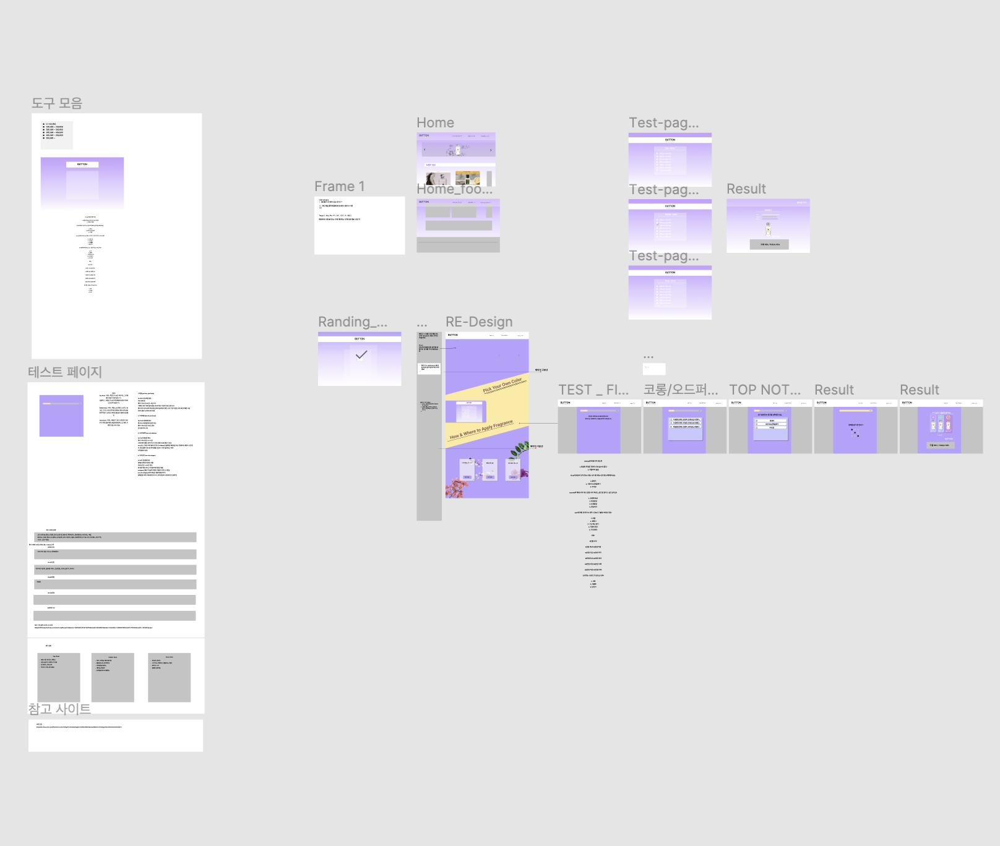

<div align="center">
  <h1>✨ Button ✨</h1>
  <p> for change your mood 💐</p>
  </div>

[목차]

0. [팀원 소개](#chapter-0)
1. [목표와 기능](#chapter-1)
2. [개발 환경 및 배포 URL](#chapter-2)
3. [프로젝트 구조와 개발 일정](#chapter-3)
4. [UI / BM](#chapter-4)
5. [메인 기능](#chapter-5)
6. [개발하면서 느낀점](#chapter-6)

<br>

## 💐 팀원 소개 <a id="chapter-0"></a>

<hr>

<table>
    <tr height="160px">
        <td  width="150px">
            <a href="https://github.com/yoojin-park19"></a>
            <br />
            <strong>박유진</strong>
        </td>
        <td  width="150px">
            <a href="https://github.com/Sangdon1029"></a>
            <br />
            <strong>김상돈</strong>
        </td>
    </tr>
</table>

<br><br>

## 🌷 목표와 기능 <a id="chapter-1"></a>

<hr>

### 1.1 목표

- 복잡하고 어려운 향수의 종류나 브랜드들을 좀 더 간단하고 편리하게 살펴 볼 수 있으면, 본인의 분위기나 그날의 기분등에 따라 향수를 간단하게 찾아볼 수 있도록 만들었습니다.

#### 1.2 기능

- 복잡하고 어려운 향수를 좀 더 쉽고, 간단하게 살펴볼 수 있다.
- 원하는 향수 또는 선물 정보를 간편하게 얻을 수 있다.
- 향수를 예산, 분류, 향기종류 별로 살펴볼 수 있다.

<br><br>

## 🌹 개발 환경 및 배포 URL <a id="chapter-2"></a>

<hr>

#### 2.1 개발 환경

- 프론트 개발 환경 : React & emotionJS

#### 2.2 배포 URL

[ Button ]<a href="https://www.mybutton.shop/"> https://www.mybutton.shop/</a>

<br><br>

## 🌸 프로젝트 구조와 개발 일정 <a id="chapter-3"></a>

</hr>

#### 3.1 프로젝트 구조

```
├── README.md
├── asort.jsx
├── filtet.js
├── package-lock.json
├── package.json
├── public
│   ├── Fonts
│   ├── images
│   └── index.html
├── src
│   ├── App.css
│   ├── App.js
│   ├── components
│   │   ├── About
│   │   │   ├── AboutMain.jsx
│   │   │   ├── Background.jsx
│   │   │   ├── BackgroundItem.jsx
│   │   │   ├── Demo.txt
│   │   │   ├── ItemCont
│   │   │   │   └── TextContainer.jsx
│   │   │   ├── ItemContainer.jsx
│   │   │   └── Nav.jsx
│   │   ├── Background
│   │   │   └── BackAnimation.jsx
│   │   ├── Category
│   │   │   ├── BrandCategory.jsx
│   │   │   ├── CategoryItem.jsx
│   │   │   ├── CategoryMain.jsx
│   │   │   ├── GenderCategory.jsx
│   │   │   ├── MiddleCategory.jsx
│   │   │   └── PriceCategory.jsx
│   │   ├── Main
│   │   │   ├── FirstMain.jsx
│   │   │   ├── ForthMain.jsx
│   │   │   ├── ItemStar.jsx
│   │   │   ├── MainBackAni.jsx
│   │   │   ├── SecondMain.jsx
│   │   │   └── ThirdMain.jsx
│   │   ├── MainHeader.jsx
│   │   ├── Result
│   │   │   └── Card.jsx
│   │   └── Test
│   │       ├── Question0ne.jsx
│   │       └── QuestionGift.jsx
│   ├── constants
│   │   ├── database.jsx
│   │   ├── index.jsx
│   │   └── testList.jsx
│   ├── index.js
│   ├── pages
│   │   ├── about.jsx
│   │   ├── category.jsx
│   │   ├── forGift.jsx
│   │   ├── giftResult.jsx
│   │   ├── home.jsx
│   │   ├── main.jsx
│   │   ├── result.jsx
│   │   └── test.jsx
│   └── reset.css
└── yarn.lock
```

### 3.2 개발 일정

- 40일 소요
- 3월 16일 - 4월24일

<br><br>

## 🌼 UI / BM <a id="chapter-4"></a>

<hr>



<br><br>

## 🌺 기능 <a id="chapter-5"></a>

<hr>

### 👠 &nbsp; 원하는 향수를 간단하게 찾아볼 수 있습니다.

> - 향수의 탑노트, 미들노트, 베이스노트, 농도등을 좀더 가까운 말들로 표현했습니다.
> - 원하는 향수의 농도, 향종류, 예산등을 선택하면 딱 맞는 향수를 추천해 줍니다.

### 🎁 &nbsp; 향수를 쉽게 선택하여 선물 할 수 있습니다.

> - 복잡하고 전문적인 향수를 좀 더 편리하게 살펴볼 수 있습니다.
> - 상대방의 분위기나 최근 기분등을 안다면 쉽게 맞는 향수를 선물할 수 있습니다.

### 🎯 &nbsp; 여러카테고리로 분류해서 찾아볼 수 있습니다.

> - 정확히 원하는 것이 없다면, 원하는 카테고리 별로 향수를 나누어 볼 수 있습니다.
> - 가격, 향류, 농도 등으로 향수를 나누어 볼 수 있습니다.

<br><br>

## 👐 개발하며 느낀점 <a id="chapter-6"></a>

<hr>

### 🙋‍♀️ 박유진

> 제가 프론트엔드를 시작하게 된 이유는 많은 사람들이 전문적이거나 복잡해서 접근하기 힘든 것들을 좀 더 쉽고 편리하게 접근할 수 있도록 하고자 공부를 시작하게 되었습니다. 그 중에서도 이번 프로젝트는 향수를 선택했습니다. 향수는 가깝고 친근하긴 하지만, 단어도 알아듣기 힘들고, 너무 다양해서 고르는데도 어려움을 겪는 분들이 많습니다. 그래서 이런 프로젝트를 시작하게 되었습니다.
> 프로젝트를 진행하면서 사람들에게 향수를 소개하기 위해 저 역시 향수에 대한 많은 공부가 필요했습니다. 그러면서 향수를 좀 더 알게 되었고, 좀 더 사람들에게 쉽게 설명할 수 있는 정독 되었습니다. <br>
> 이러한 과정을 거치면서 프론트엔드로써 사람들에게 쉽고 편리하게 정보를 전달해 주기 위해서는 어떤 방법들이 필요한지 다시한번 생각해보는 계기가 되었습니다. 그리고 그를 위해서는 그 분야에 대한 공부가 필요하다는 것도 느끼게 되었습니다. 앞으로도 이러한 점들을 잊지않고, 사람들이 쉽고 편리하게 정보에 접근하기 위해서는 어떤 것들이 필요한지 계속 고민해보고, 그에 맞춰 발전하는 개발자이고 싶습니다.

### 🙋 김상돈

> 이번 프로젝트는 아이디어 계획 부터 직접 설정하고 만들다 보니, 이전에 프로젝트를 하면서 배웠던 기술들을 활용할 수 있어서 좋은 경험이 되었습니다. 또한, 정말 주위에서 사람들이 사용할 수 있는 웹을 만들 수 있었다는 것이 이번 프로젝트를 하면서 가장 의미있는 부분입니다. 그리고, 저희가 원하는 기능을 구현하기 위해서 어떻게해서든, 배우고 찾아보는 것이 저의 발전에 있어서 정말 좋은 밑거름이 되었다고 생각합니다.
